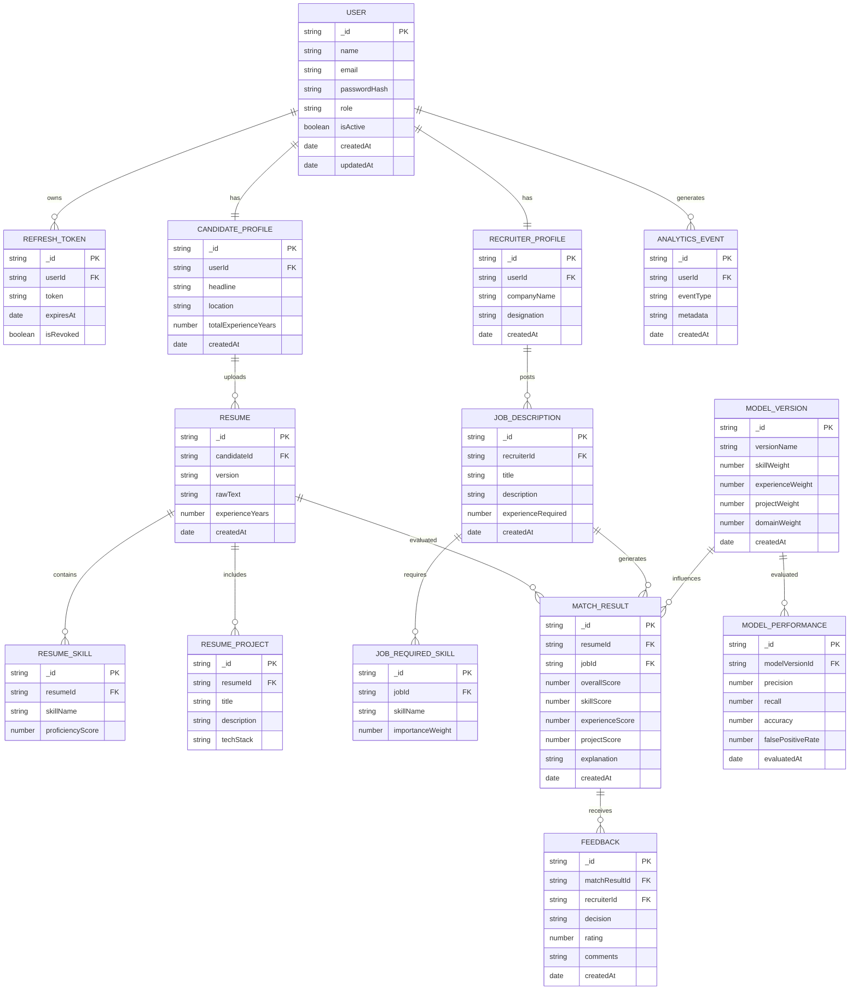

# ER Diagram – HireLens AI

```mermaid
erDiagram

USER {
    string _id PK
    string name
    string email
    string passwordHash
    string role
    boolean isActive
    date createdAt
    date updatedAt
}

REFRESH_TOKEN {
    string _id PK
    string userId FK
    string token
    date expiresAt
    boolean isRevoked
}

CANDIDATE_PROFILE {
    string _id PK
    string userId FK
    string headline
    string location
    number totalExperienceYears
    date createdAt
}

RESUME {
    string _id PK
    string candidateId FK
    string version
    string rawText
    number experienceYears
    date createdAt
}

RESUME_SKILL {
    string _id PK
    string resumeId FK
    string skillName
    number proficiencyScore
}

RESUME_PROJECT {
    string _id PK
    string resumeId FK
    string title
    string description
    string techStack
}

RECRUITER_PROFILE {
    string _id PK
    string userId FK
    string companyName
    string designation
    date createdAt
}

JOB_DESCRIPTION {
    string _id PK
    string recruiterId FK
    string title
    string description
    number experienceRequired
    date createdAt
}

JOB_REQUIRED_SKILL {
    string _id PK
    string jobId FK
    string skillName
    number importanceWeight
}

MATCH_RESULT {
    string _id PK
    string resumeId FK
    string jobId FK
    number overallScore
    number skillScore
    number experienceScore
    number projectScore
    string explanation
    date createdAt
}

FEEDBACK {
    string _id PK
    string matchResultId FK
    string recruiterId FK
    string decision
    number rating
    string comments
    date createdAt
}

MODEL_VERSION {
    string _id PK
    string versionName
    number skillWeight
    number experienceWeight
    number projectWeight
    number domainWeight
    date createdAt
}

MODEL_PERFORMANCE {
    string _id PK
    string modelVersionId FK
    number precision
    number recall
    number accuracy
    number falsePositiveRate
    date evaluatedAt
}

ANALYTICS_EVENT {
    string _id PK
    string userId FK
    string eventType
    string metadata
    date createdAt
}

%% Relationships

USER ||--o{ REFRESH_TOKEN : owns
USER ||--|| CANDIDATE_PROFILE : has
USER ||--|| RECRUITER_PROFILE : has

CANDIDATE_PROFILE ||--o{ RESUME : uploads
RESUME ||--o{ RESUME_SKILL : contains
RESUME ||--o{ RESUME_PROJECT : includes

RECRUITER_PROFILE ||--o{ JOB_DESCRIPTION : posts
JOB_DESCRIPTION ||--o{ JOB_REQUIRED_SKILL : requires

RESUME ||--o{ MATCH_RESULT : evaluated
JOB_DESCRIPTION ||--o{ MATCH_RESULT : generates

MATCH_RESULT ||--o{ FEEDBACK : receives

MODEL_VERSION ||--o{ MATCH_RESULT : influences
MODEL_VERSION ||--o{ MODEL_PERFORMANCE : evaluated

USER ||--o{ ANALYTICS_EVENT : generates
```
