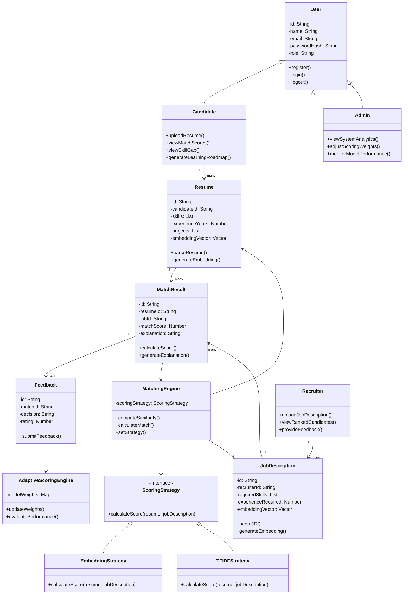

# Class Diagram – HireLens AI

```mermaid
classDiagram

%% ========================
%% Base User Class
%% ========================

class User {
  -id: String
  -name: String
  -email: String
  -passwordHash: String
  -role: String
  +register()
  +login()
  +logout()
}

class Candidate {
  +uploadResume()
  +viewMatchScores()
  +viewSkillGap()
  +generateLearningRoadmap()
}

class Recruiter {
  +uploadJobDescription()
  +viewRankedCandidates()
  +provideFeedback()
}

class Admin {
  +viewSystemAnalytics()
  +adjustScoringWeights()
  +monitorModelPerformance()
}

User <|-- Candidate
User <|-- Recruiter
User <|-- Admin


%% ========================
%% Core Domain Classes
%% ========================

class Resume {
  -id: String
  -candidateId: String
  -skills: List
  -experienceYears: Number
  -projects: List
  -embeddingVector: Vector
  +parseResume()
  +generateEmbedding()
}

class JobDescription {
  -id: String
  -recruiterId: String
  -requiredSkills: List
  -experienceRequired: Number
  -embeddingVector: Vector
  +parseJD()
  +generateEmbedding()
}

class MatchResult {
  -id: String
  -resumeId: String
  -jobId: String
  -matchScore: Number
  -explanation: String
  +calculateScore()
  +generateExplanation()
}

class Feedback {
  -id: String
  -matchId: String
  -decision: String
  -rating: Number
  +submitFeedback()
}


%% ========================
%% AI & Strategy Layer
%% ========================

class MatchingEngine {
  -scoringStrategy: ScoringStrategy
  +computeSimilarity()
  +calculateMatch()
  +setStrategy()
}

class ScoringStrategy {
  <<interface>>
  +calculateScore(resume, jobDescription)
}

class EmbeddingStrategy {
  +calculateScore(resume, jobDescription)
}

class TFIDFStrategy {
  +calculateScore(resume, jobDescription)
}

ScoringStrategy <|.. EmbeddingStrategy
ScoringStrategy <|.. TFIDFStrategy

MatchingEngine --> ScoringStrategy


class AdaptiveScoringEngine {
  -modelWeights: Map
  +updateWeights()
  +evaluatePerformance()
}

Feedback --> AdaptiveScoringEngine


%% ========================
%% Relationships
%% ========================

Candidate "1" --> "many" Resume
Recruiter "1" --> "many" JobDescription
Resume "1" --> "many" MatchResult
JobDescription "1" --> "many" MatchResult
MatchResult "1" --> "0..1" Feedback

MatchingEngine --> Resume
MatchingEngine --> JobDescription
MatchResult --> MatchingEngine
```
