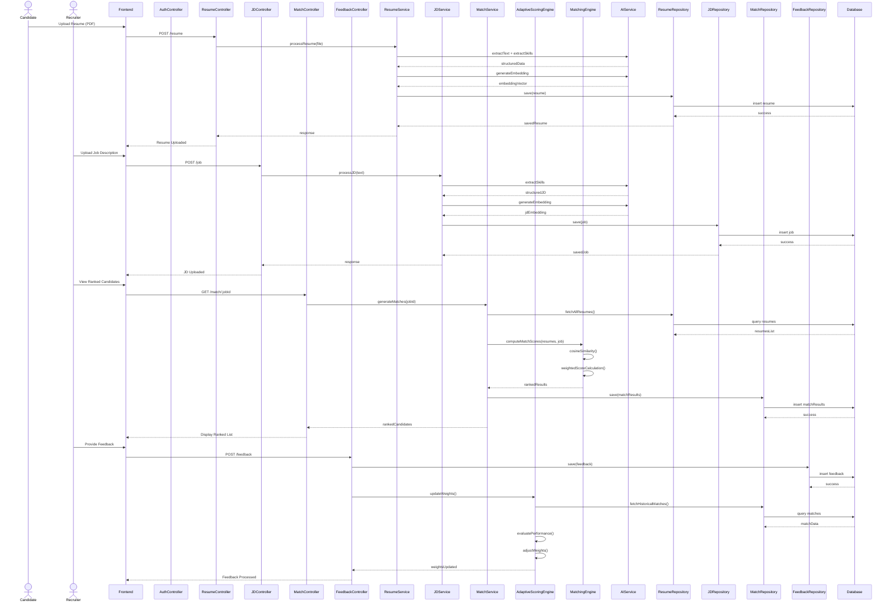

# Sequence Diagram – HireLens AI  
## Main Flow: Resume Upload → Matching → Feedback → Adaptive Update

```mermaid
sequenceDiagram

actor Candidate
actor Recruiter

participant Frontend
participant AuthController
participant ResumeController
participant JDController
participant MatchController
participant FeedbackController

participant ResumeService
participant JDService
participant MatchService
participant AdaptiveScoringEngine
participant MatchingEngine

participant AIService
participant ResumeRepository
participant JDRepository
participant MatchRepository
participant FeedbackRepository
participant Database


%% =========================
%% 1️⃣ Resume Upload Flow
%% =========================

Candidate ->> Frontend: Upload Resume (PDF)
Frontend ->> ResumeController: POST /resume

ResumeController ->> ResumeService: processResume(file)
ResumeService ->> AIService: extractText + extractSkills
AIService -->> ResumeService: structuredData

ResumeService ->> AIService: generateEmbedding
AIService -->> ResumeService: embeddingVector

ResumeService ->> ResumeRepository: save(resume)
ResumeRepository ->> Database: insert resume
Database -->> ResumeRepository: success

ResumeRepository -->> ResumeService: savedResume
ResumeService -->> ResumeController: response
ResumeController -->> Frontend: Resume Uploaded


%% =========================
%% 2️⃣ Job Description Upload
%% =========================

Recruiter ->> Frontend: Upload Job Description
Frontend ->> JDController: POST /job

JDController ->> JDService: processJD(text)
JDService ->> AIService: extractSkills
AIService -->> JDService: structuredJD

JDService ->> AIService: generateEmbedding
AIService -->> JDService: jdEmbedding

JDService ->> JDRepository: save(job)
JDRepository ->> Database: insert job
Database -->> JDRepository: success

JDRepository -->> JDService: savedJob
JDService -->> JDController: response
JDController -->> Frontend: JD Uploaded


%% =========================
%% 3️⃣ Matching Flow
%% =========================

Recruiter ->> Frontend: View Ranked Candidates
Frontend ->> MatchController: GET /match/:jobId

MatchController ->> MatchService: generateMatches(jobId)

MatchService ->> ResumeRepository: fetchAllResumes()
ResumeRepository ->> Database: query resumes
Database -->> ResumeRepository: resumesList

MatchService ->> MatchingEngine: computeMatchScores(resumes, job)

MatchingEngine ->> MatchingEngine: cosineSimilarity()
MatchingEngine ->> MatchingEngine: weightedScoreCalculation()

MatchingEngine -->> MatchService: rankedResults

MatchService ->> MatchRepository: save(matchResults)
MatchRepository ->> Database: insert matchResults
Database -->> MatchRepository: success

MatchService -->> MatchController: rankedCandidates
MatchController -->> Frontend: Display Ranked List


%% =========================
%% 4️⃣ Feedback & Adaptive Update
%% =========================

Recruiter ->> Frontend: Provide Feedback
Frontend ->> FeedbackController: POST /feedback

FeedbackController ->> FeedbackRepository: save(feedback)
FeedbackRepository ->> Database: insert feedback
Database -->> FeedbackRepository: success

FeedbackController ->> AdaptiveScoringEngine: updateWeights()

AdaptiveScoringEngine ->> MatchRepository: fetchHistoricalMatches()
MatchRepository ->> Database: query matches
Database -->> MatchRepository: matchData

AdaptiveScoringEngine ->> AdaptiveScoringEngine: evaluatePerformance()
AdaptiveScoringEngine ->> AdaptiveScoringEngine: adjustWeights()

AdaptiveScoringEngine -->> FeedbackController: weightsUpdated
FeedbackController -->> Frontend: Feedback Processed
```
