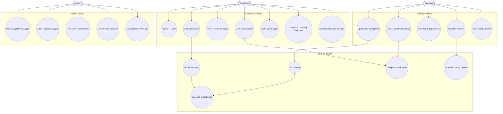

# Use Case Diagram – HireLens AI

```mermaid
flowchart TB

%% Actors
Candidate([Candidate])
Recruiter([Recruiter])
Admin([Admin])

%% Candidate Module
subgraph Candidate_Module
direction TB
C1((Register / Login))
C2((Upload Resume))
C3((View Resume Analysis))
C4((View Match Scores))
C5((Skill Gap Analysis))
C6((Generate Learning Roadmap))
C7((Compare Resume Versions))
end

%% Recruiter Module
subgraph Recruiter_Module
direction TB
R1((Upload Job Description))
R2((View Ranked Candidates))
R3((View Match Explanation))
R4((Provide Feedback))
R5((View Hiring Analytics))
end

%% Admin Module
subgraph Admin_Module
direction TB
A1((Monitor System Analytics))
A2((Adjust Scoring Weights))
A3((View Model Performance))
A4((Monitor Bias Indicators))
A5((Manage Model Versions))
end

%% Core Engine Module
subgraph Core_AI_Engine
direction TB
E1((Resume Parsing))
E2((JD Parsing))
E3((Generate Embeddings))
E4((Compute Match Score))
E5((Adaptive Scoring Update))
end

%% Actor Connections
Candidate --> C1
Candidate --> C2
Candidate --> C3
Candidate --> C4
Candidate --> C5
Candidate --> C6
Candidate --> C7

Recruiter --> R1
Recruiter --> R2
Recruiter --> R3
Recruiter --> R4
Recruiter --> R5

Admin --> A1
Admin --> A2
Admin --> A3
Admin --> A4
Admin --> A5

%% Internal Flow (Cleaner)
C2 --> E1 --> E3
R1 --> E2 --> E3
C4 --> E4
R2 --> E4
R4 --> E5
```
